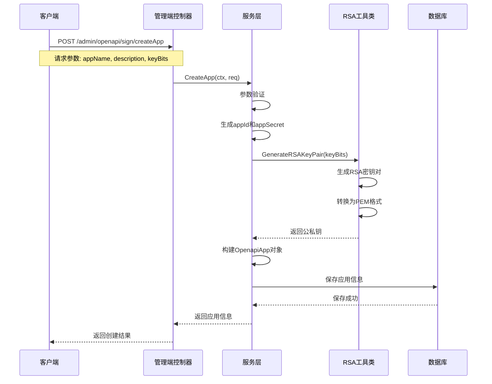

# OpenAPI 创建应用流程详解

## 概述
本文档详细描述了 OpenAPI 模块中创建应用的完整流程，包括API接口、服务层处理、数据库操作和RSA密钥生成等环节。

## 流程架构图

```
客户端请求
    ↓
管理端控制器 (admin/openapi_sign.go)
    ↓
服务层 (service/openapi_sign.go)
    ↓
RSA工具类 (utils/rsa_sign.go)
    ↓
数据库模型 (model/openapi_app.go)
    ↓
返回响应
```

## 详细流程步骤

### 1. API接口层 (`/Users/mac/workspace/vgo-v2/modules/openapi/controller/admin/openapi_sign.go`)

#### CreateApp 方法
```go
// CreateApp 创建应用
// 功能: 处理创建应用的HTTP请求
// 参数: 
//   - ctx: 请求上下文
//   - req: 创建应用请求结构体
// 返回值: 
//   - res: 创建应用响应结构体
//   - err: 错误信息
func (c *OpenapiSignController) CreateApp(ctx context.Context, req *v1.CreateAppReq) (res *model.OpenapiAppRes, err error) {
    res, err = service.OpenapiSignService().CreateApp(ctx, req)
    if err != nil {
        return nil, err
    }
    return res, nil
}
```

**请求参数结构** (`/Users/mac/workspace/vgo-v2/modules/openapi/api/v1/openapi_admin.go`):
```go
type CreateAppReq struct {
    g.Meta      `path:"/createApp" method:"POST" summary:"创建应用" tags:"开放平台管理"`
    AppName     string `json:"appName" v:"required#应用名称不能为空"`
    Description string `json:"description"`
}
```

### 2. 服务层处理 (`/Users/mac/workspace/vgo-v2/modules/openapi/service/openapi_sign.go`)

#### CreateApp 服务方法
```go
// CreateApp 创建应用
// 功能: 创建新的开放平台应用，生成应用ID、密钥和RSA密钥对
// 参数:
//   - ctx: 上下文
//   - req: 创建应用请求
// 返回值:
//   - *model.OpenapiAppRes: 应用信息响应
//   - error: 错误信息
func (s *sOpenapiSign) CreateApp(ctx context.Context, req *v1.CreateAppReq) (*model.OpenapiAppRes, error) {
    // 1. 参数验证
    if req.AppName == "" {
        return nil, gerror.New("应用名称不能为空")
    }

    // 2. 设置默认密钥位数
    if req.KeyBits == 0 {
        req.KeyBits = 2048
    }

    // 3. 生成应用ID和密钥
    appId := gstr.Replace(guid.S(), "-", "")
    appSecret := gstr.Replace(guid.S(), "-", "")

    // 4. 生成RSA密钥对
    rsaUtil := utils.NewRSASignUtil()
    privateKey, publicKey, err := rsaUtil.GenerateRSAKeyPair(req.KeyBits)
    if err != nil {
        return nil, gerror.Wrap(err, "生成RSA密钥对失败")
    }

    // 5. 创建应用记录
    app := &model.OpenapiApp{
        Model:       v.NewModel(),
        AppId:       appId,
        AppName:     req.AppName,
        AppSecret:   appSecret,
        PublicKey:   publicKey,
        PrivateKey:  privateKey,
        Status:      gconv.Int32Ptr(1),
        Description: req.Description,
    }

    // 6. 保存到数据库
    err = v.Model(app).Save(ctx, app)
    if err != nil {
        return nil, gerror.Wrap(err, "保存应用信息失败")
    }

    // 7. 返回响应
    return &model.OpenapiAppRes{
        AppId:       app.AppId,
        AppName:     app.AppName,
        AppSecret:   app.AppSecret,
        PublicKey:   app.PublicKey,
        Status:      app.Status,
        Description: app.Description,
        CreateAt:    app.CreateAt,
        UpdateAt:    app.UpdateAt,
    }, nil
}
```

### 3. RSA密钥生成 (`/Users/mac/workspace/vgo-v2/modules/openapi/utils/rsa_sign.go`)

#### GenerateRSAKeyPair 方法
```go
// GenerateRSAKeyPair 生成RSA密钥对
// 功能: 生成指定位数的RSA公私钥对，并转换为PEM格式
// 参数:
//   - bits: 密钥位数（建议2048或更高）
// 返回值:
//   - string: PEM格式的私钥
//   - string: PEM格式的公钥
//   - error: 错误信息
func (r *RSASignUtil) GenerateRSAKeyPair(bits int) (string, string, error) {
    // 1. 生成RSA密钥对
    privateKey, err := rsa.GenerateKey(rand.Reader, bits)
    if err != nil {
        return "", "", gerror.Wrap(err, "生成RSA密钥对失败")
    }

    // 2. 编码私钥为PEM格式
    privateKeyBytes, err := x509.MarshalPKCS8PrivateKey(privateKey)
    if err != nil {
        return "", "", gerror.Wrap(err, "编码私钥失败")
    }

    privateKeyPEM := pem.EncodeToMemory(&pem.Block{
        Type:  "PRIVATE KEY",
        Bytes: privateKeyBytes,
    })

    // 3. 编码公钥为PEM格式
    publicKeyBytes, err := x509.MarshalPKIXPublicKey(&privateKey.PublicKey)
    if err != nil {
        return "", "", gerror.Wrap(err, "编码公钥失败")
    }

    publicKeyPEM := pem.EncodeToMemory(&pem.Block{
        Type:  "PUBLIC KEY",
        Bytes: publicKeyBytes,
    })

    return string(privateKeyPEM), string(publicKeyPEM), nil
}
```

### 4. 数据库模型 (`/Users/mac/workspace/vgo-v2/modules/openapi/model/openapi_app.go`)

#### OpenapiApp 模型结构
```go
// OpenapiApp 开放平台应用模型，用于存储应用信息和RSA密钥对
type OpenapiApp struct {
    *v.Model
    AppId       string `gorm:"column:app_id;type:varchar(64);not null;uniqueIndex;comment:应用ID" json:"appId"`
    AppName     string `gorm:"column:app_name;type:varchar(255);not null;comment:应用名称" json:"appName"`
    AppSecret   string `gorm:"column:app_secret;type:varchar(255);not null;comment:应用密钥" json:"appSecret"`
    PublicKey   string `gorm:"column:public_key;type:text;not null;comment:RSA公钥" json:"publicKey"`
    PrivateKey  string `gorm:"column:private_key;type:text;not null;comment:RSA私钥" json:"privateKey"`
    Status      *int32 `gorm:"column:status;type:int;not null;default:1;comment:状态 0:禁用 1:启用" json:"status"`
    Description string `gorm:"column:description;type:varchar(500);comment:应用描述" json:"description"`
    Remark      string `gorm:"column:remark;type:varchar(255);comment:备注" json:"remark"`
}
```

## 完整流程时序图



## 关键技术点

### 1. 应用ID和密钥生成
- 使用 `guid.S()` 生成UUID，并移除连字符
- AppId 和 AppSecret 都采用相同的生成方式
- 确保全局唯一性

### 2. RSA密钥对生成
- 支持自定义密钥位数（最小2048位）
- 使用标准的PKCS#8格式编码私钥
- 使用PKIX格式编码公钥
- 输出PEM格式便于存储和传输

### 3. 数据库设计
- AppId 设置唯一索引确保不重复
- 私钥和公钥使用TEXT类型存储PEM格式
- Status 字段支持启用/禁用状态管理
- 继承基础Model提供创建时间、更新时间等字段

### 4. 错误处理
- 每个环节都有详细的错误处理
- 使用 `gerror.Wrap` 包装错误信息
- 提供中文错误提示

## API调用示例

### 请求
```bash
curl -X POST http://localhost:8001/admin/openapi/sign/createApp \
  -H "Content-Type: application/json" \
  -d '{
    "appName": "测试应用",
    "description": "这是一个测试应用",
    "keyBits": 2048
  }'
```

### 响应
```json
{
  "code": 200,
  "message": "success",
  "data": {
    "appId": "a1b2c3d4e5f6g7h8i9j0k1l2m3n4o5p6",
    "appName": "测试应用",
    "appSecret": "x1y2z3a4b5c6d7e8f9g0h1i2j3k4l5m6",
    "publicKey": "-----BEGIN PUBLIC KEY-----\n...\n-----END PUBLIC KEY-----",
    "status": 1,
    "description": "这是一个测试应用",
    "createAt": "2024-01-01T12:00:00Z",
    "updateAt": "2024-01-01T12:00:00Z"
  }
}
```

## 注意事项

1. **安全性**: 私钥仅在服务端存储，不会返回给客户端
2. **密钥位数**: 建议使用2048位或更高的密钥长度
3. **应用状态**: 新创建的应用默认为启用状态
4. **唯一性**: AppId 具有唯一性约束，确保不会重复
5. **错误处理**: 所有可能的错误都有相应的处理和提示